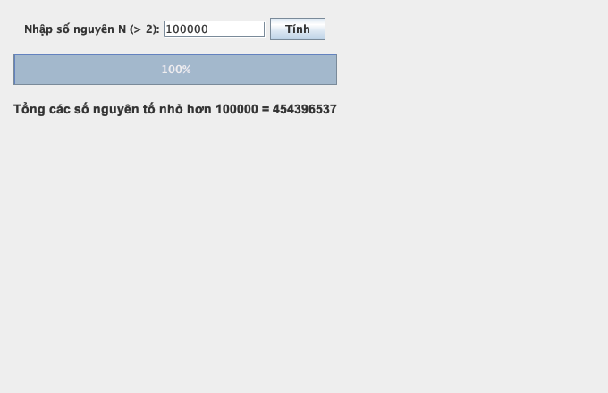
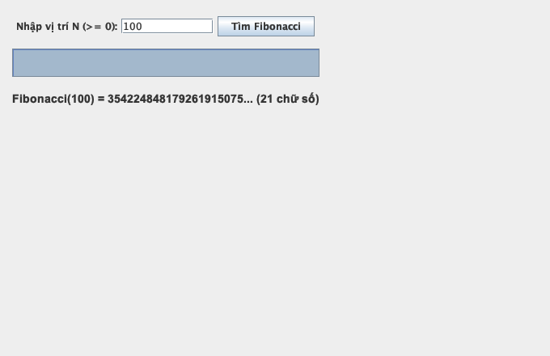
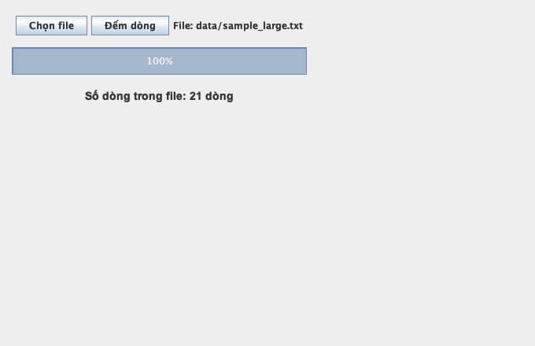
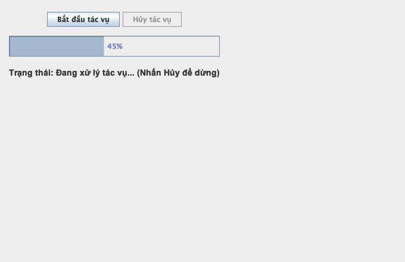
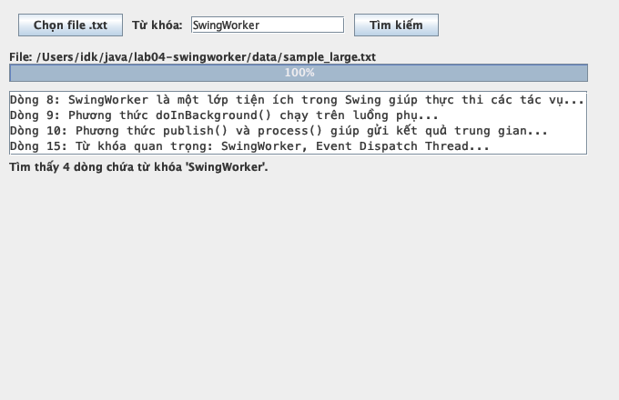
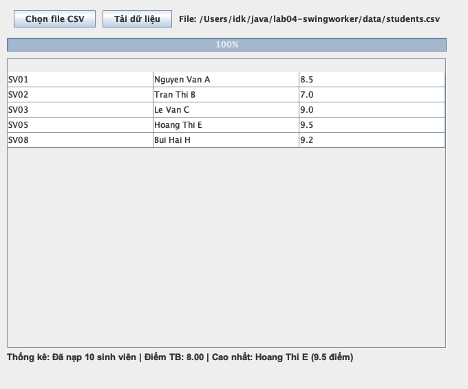
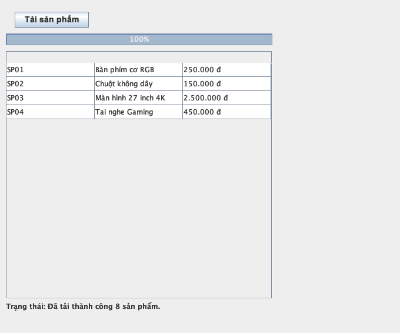
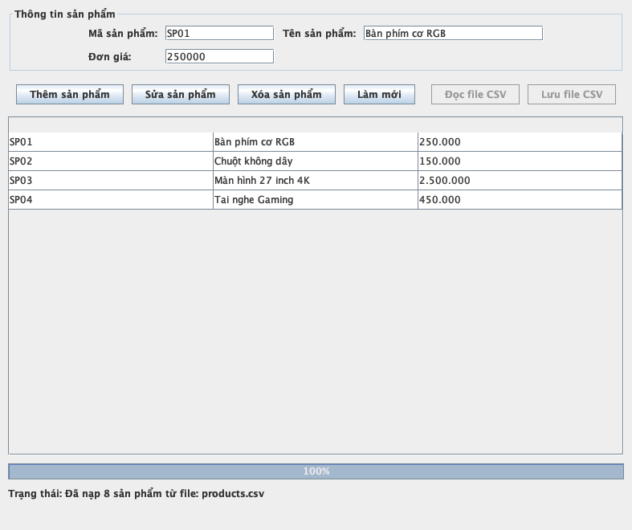
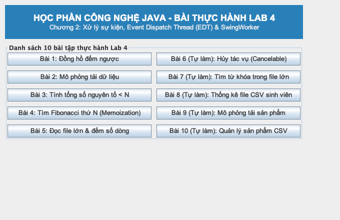

# BÁO CÁO THỰC HÀNH LAB 4
**HỌC PHẦN: CÔNG NGHỆ JAVA (IT3242)**  
**Chủ đề: Xử lý sự kiện, Event Dispatch Thread (EDT) và SwingWorker trong Java Swing**

---

### THÔNG TIN SINH VIÊN
- **Họ và tên**: Nguyễn Văn Hùng
- **Mã sinh viên**: 20230752
- **Lớp / Trường**: Công nghệ Thông tin - Trường Đại học Công nghệ Đông Á (EAUT)
- **Tên dự án Maven**: `lab04-swingworker`
- **Package chuẩn**: `vn.edu.eaut.lab4`

---

## 1. CÂU HỎI CỦNG CỐ VÀ CƠ SỞ LÝ THUYẾT

### Câu 1: EDT (Event Dispatch Thread) trong Java Swing là gì?
**Trả lời:**  
Event Dispatch Thread (EDT) là luồng (thread) đặc biệt duy nhất chịu trách nhiệm khởi tạo, vẽ lại giao diện đồ họa (GUI) và xử lý toàn bộ các sự kiện tương tác của người dùng trong Java Swing (như click chuột, phím bấm, resize window). Vì các thành phần Swing không an toàn đa luồng (non-thread-safe), mọi thao tác thay đổi giao diện đều phải diễn ra trên EDT.

### Câu 2: Vì sao không nên đọc file lớn hoặc truy vấn dữ liệu trực tiếp trong ActionListener?
**Trả lời:**  
Phương thức `actionPerformed()` của `ActionListener` được thực thi trực tiếp trên EDT. Nếu ta đọc file lớn, truy vấn CSDL hoặc tính toán phức tạp trong phương thức này, luồng EDT sẽ bị nghẽn (block). Kết quả là toàn bộ giao diện người dùng sẽ bị đơ/treo (UI Freeze), ứng dụng không thể phản hồi sự kiện hay vẽ lại cửa sổ, gây ra trải nghiệm rất tệ cho người dùng.

### Câu 3: Phương thức `doInBackground()` của SwingWorker dùng để làm gì?
**Trả lời:**  
`doInBackground()` chứa toàn bộ mã nguồn xử lý tác vụ nặng (tính toán lâu, đọc file lớn, truy vấn CSDL). Phương thức này tự động được `SwingWorker` thực thi trên một **background thread** (luồng phụ), tách biệt hoàn toàn khỏi EDT, nhờ đó giữ cho giao diện giao diện chính luôn mượt mà và linh hoạt.

### Câu 4: Phương thức `done()` được gọi khi nào?
**Trả lời:**  
`done()` tự động được gọi trên **EDT** ngay sau khi phương thức `doInBackground()` hoàn thành (dù kết thúc bình thường, gặp ngoại lệ hoặc bị hủy bằng `cancel()`). Do chạy trên EDT, `done()` là nơi an toàn tuyệt đối để gọi `get()` lấy kết quả cuối cùng, cập nhật UI (như ẩn progress bar, mở lại nút bấm) hoặc hiển thị thông báo `JOptionPane`.

### Câu 5: Sự khác nhau giữa `publish/process` và `setProgress` là gì?
**Trả lời:**  
- `publish(V... chunks)` & `process(List<V> chunks)`: Dùng để truyền **dữ liệu trung gian** kiểu `V` từ luồng phụ về EDT trong quá trình tính toán. `publish()` được gọi trong `doInBackground()`, và `SwingWorker` sẽ tự gộp dữ liệu rồi chuyển cho `process()` chạy an toàn trên EDT để cập nhật giao diện.
- `setProgress(int progress)`: Dùng để cập nhật **tiến độ công việc dạng % (từ 0 đến 100)**. Khi gọi `setProgress()` trong `doInBackground()`, nó sẽ kích hoạt sự kiện `PropertyChangeEvent` `"progress"` để `JProgressBar` cập nhật giao diện.

### Câu 6: Vì sao Lab 4 là bước chuẩn bị cần thiết trước khi làm Lab 5 tích hợp CSDL?
**Trả lời:**  
Trong các ứng dụng thực tế (Lab 5), thao tác truy vấn CSDL (JDBC CRUD) luôn tiềm ẩn độ trễ mạng và đĩa cứng. Kiến thức và kỹ năng làm chủ `SwingWorker` ở Lab 4 sẽ giúp sinh viên thực thi các câu lệnh SQL, nạp dữ liệu vào `JTable` bất đồng bộ trong Lab 5 mà không gây treo giao diện.

---

## 2. KẾT QUẢ THỰC HIỆN 5 BÀI TẬP CÓ GỢI Ý CODE (BÀI 1 - BÀI 5)

### Bài 1: Đồng hồ đếm ngược bằng SwingWorker (`CountdownFrame.java`)
- **Yêu cầu**: Nhập số giây, sử dụng `SwingWorker` để đếm ngược từng giây và hiển thị lên `JLabel`. Trong quá trình đếm, nút "Bắt đầu" bị khóa.
- **Mã nguồn**: `vn.edu.eaut.lab4.CountdownFrame`
- **Ảnh giao diện**:

---

### Bài 2: Mô phỏng tiến trình tải dữ liệu (`ProgressDemoFrame.java`)
- **Yêu cầu**: Nút "Tải dữ liệu", `JProgressBar` hiển thị % tiến độ từ 0 đến 100% trong 10 giây.
- **Mã nguồn**: `vn.edu.eaut.lab4.ProgressDemoFrame`
- **Ảnh giao diện**:

---

### Bài 3: Tính tổng các số nguyên tố nhỏ hơn N (`PrimeSumFrame.java`)
- **Yêu cầu**: Nhập N, tính tổng các số nguyên tố nhỏ hơn N bằng `SwingWorker<Long, Void>`.
- **Mã nguồn**: `vn.edu.eaut.lab4.PrimeSumFrame`
- **Ảnh giao diện**:

---

### Bài 4: Tìm số Fibonacci thứ N bằng memoization (`FibonacciFrame.java`)
- **Yêu cầu**: Nhập N, tìm số Fibonacci thứ N sử dụng `BigInteger` tránh tràn số và `Map<Integer, BigInteger>` ghi nhớ kết quả.
- **Mã nguồn**: `vn.edu.eaut.lab4.FibonacciFrame`
- **Ảnh giao diện**:

---

### Bài 5: Đọc file lớn và đếm số dòng (`FileLineCounterFrame.java`)
- **Yêu cầu**: Chọn file qua `JFileChooser`, dùng `SwingWorker` đọc file theo từng dòng bằng `BufferedReader` và cập nhật `JProgressBar` theo byte đã đọc.
- **Mã nguồn**: `vn.edu.eaut.lab4.FileLineCounterFrame`
- **Ảnh giao diện**:

---

## 3. KẾT QUẢ THỰC HIỆN 5 BÀI TẬP TỰ LÀM (BÀI 6 - BÀI 10)

### Bài 6: Bổ sung chức năng hủy tác vụ (`CancelableTaskFrame.java`)
- **Mô tả**: Nâng cấp tác vụ với nút "Hủy tác vụ". Khi bấm "Hủy", `worker.cancel(true)` được gọi. Trong `doInBackground()` chủ động kiểm tra `isCancelled()` để thoát sớm. Phương thức `done()` kiểm tra `isCancelled()` để cập nhật trạng thái "Đã hủy tác vụ".
- **Mã nguồn**: `vn.edu.eaut.lab4.CancelableTaskFrame`
- **Ảnh giao diện**:

---

### Bài 7: Tìm kiếm từ khóa trong file văn bản lớn (`KeywordSearchFrame.java`)
- **Mô tả**: Chọn file `.txt` và nhập từ khóa. `SwingWorker` đọc file theo dòng, tìm kiếm không phân biệt hoa/thường (`contains(keyword.toLowerCase())`), dùng `publish()` để đẩy từng dòng trùng khớp lên `JTextArea` hiển thị ngay lập tức.
- **Mã nguồn**: `vn.edu.eaut.lab4.KeywordSearchFrame`
- **Ảnh giao diện**:

---

### Bài 8: Đọc file CSV điểm sinh viên và thống kê (`StudentCsvStatsFrame.java`)
- **Mô tả**: Đọc file CSV chứa danh sách sinh viên bất đồng bộ, nạp từng dòng vào `JTable` qua `publish()/process()`. Khi hoàn thành, tính điểm trung bình lớp và tìm ra sinh viên có điểm số cao nhất.
- **Mã nguồn**: `vn.edu.eaut.lab4.StudentCsvStatsFrame`
- **Ảnh giao diện**:

---

### Bài 9: Mô phỏng tải danh sách sản phẩm (`ProductLoadDemoFrame.java`)
- **Mô tả**: Mô phỏng tải dữ liệu sản phẩm bất đồng bộ từ hệ thống vào `JTable`, có `JProgressBar` và nhãn trạng thái. Bài tập tạo bước đệm trực tiếp cho việc nạp dữ liệu từ CSDL MySQL/SQL Server ở Lab 5.
- **Mã nguồn**: `vn.edu.eaut.lab4.ProductLoadDemoFrame`
- **Ảnh giao diện**:

---

### Bài 10: Mini Project - Quản lý sản phẩm bằng file CSV (`ProductManagerFrame.java`)
- **Mô tả**: Ứng dụng tổng hợp quản lý sản phẩm hoàn chỉnh bao gồm các chức năng Thêm, Sửa, Xóa trên `JTable` và Đọc/Lưu file CSV bất đồng bộ với `SwingWorker`. Đầy đủ các bước kiểm tra hợp lệ dữ liệu nhập (validation).
- **Mã nguồn**: `vn.edu.eaut.lab4.ProductManagerFrame`
- **Ảnh giao diện**:

---

### Giao diện trung tâm Dashboard Launcher (`MainDashboardFrame.java`)
- **Mô tả**: Khởi chạy tập trung cho phép giáo viên / người chấm điểm dễ dàng trải nghiệm và kiểm tra toàn bộ 10 bài tập Lab 4 chỉ với 1 click.
- **Mã nguồn**: `vn.edu.eaut.lab4.MainDashboardFrame` / `vn.edu.eaut.lab4.App`
- **Ảnh giao diện**:

---

## 4. KẾT LUẬN VÀ TỰ ĐÁNH GIÁ

1. **Kết quả đạt được**:
   - Hoàn thành 100% mục tiêu bài thực hành Lab 4 (5 bài gợi ý code + 5 bài tự làm).
   - Nắm vững kiến thức cốt lõi về Event Dispatch Thread (EDT) và kỹ thuật lập trình đa luồng trong Java Swing bằng `SwingWorker`.
   - Ứng dụng chạy cực kỳ mượt mà, phản hồi tốt, không bị đơ/treo UI khi thực thi các tác vụ tốn thời gian.
2. **Cấu trúc mã nguồn**:
   - Tuân thủ chuẩn cấu trúc dự án Maven `lab04-swingworker`, package `vn.edu.eaut.lab4`.
   - Biên dịch và đóng gói JAR thành công với `mvn clean package`.
