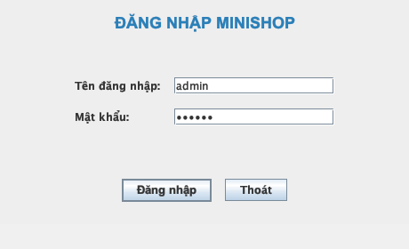
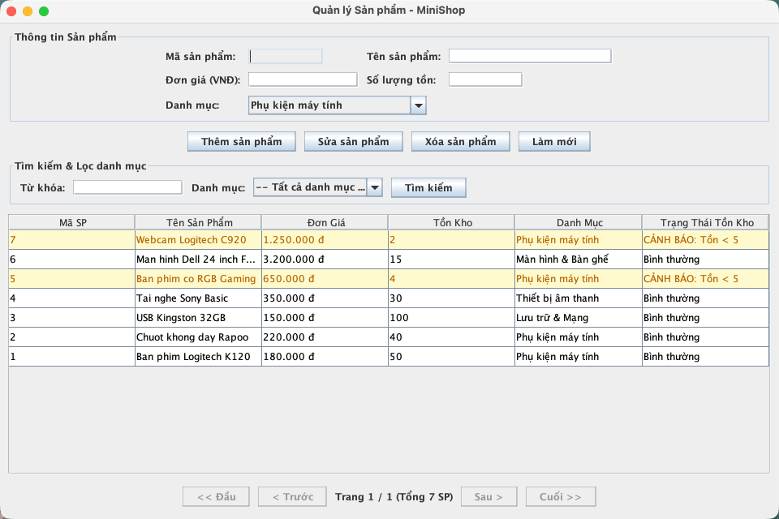
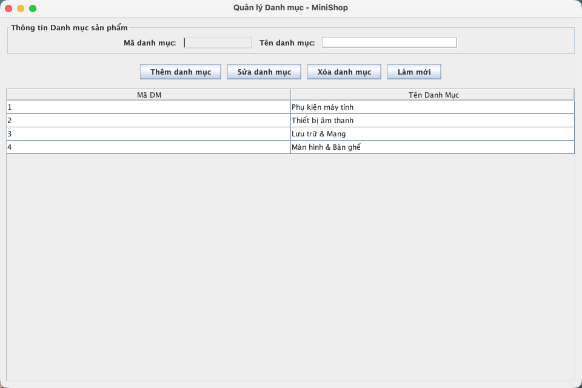
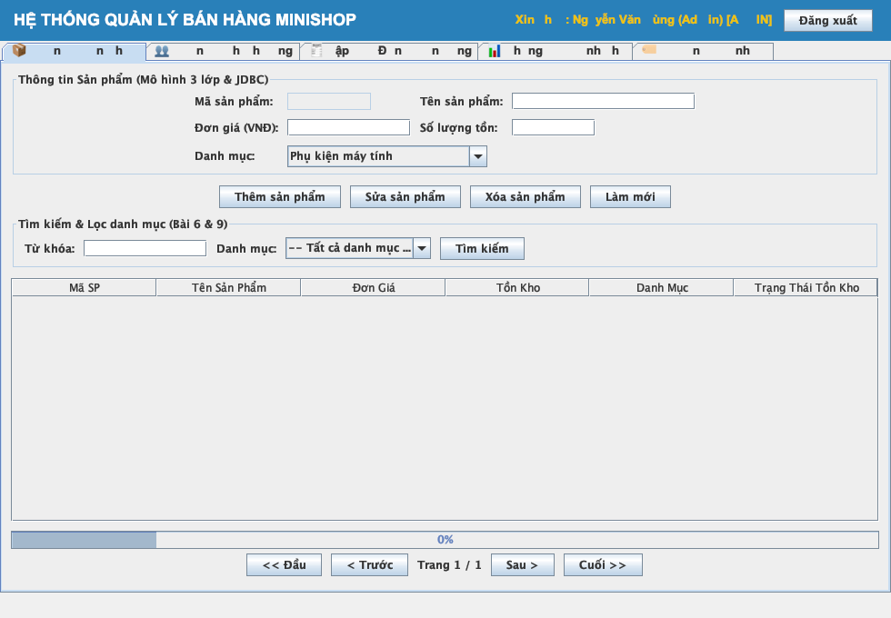

# BÁO CÁO THỰC HÀNH LAB 5
**HỌC PHẦN: CÔNG NGHỆ JAVA (IT3242)**  
**Chủ đề: Tích hợp Cơ sở dữ liệu MySQL với Java Swing - Project MiniShop**

---

### THÔNG TIN SINH VIÊN
- **Họ và tên**: Nguyễn Văn Hùng
- **Mã sinh viên**: 20230752
- **Lớp / Trường**: Công nghệ Thông tin - Trường Đại học Công nghệ Đông Á (EAUT)
- **Tên dự án Maven**: `lab05-minishop-swing-jdbc`
- **Package chuẩn**: `vn.edu.eaut.lab5`

---

## 1. CÂU HỎI CỦNG CỐ VÀ CƠ SỞ LÝ THUYẾT (10 CÂU HỎI)

### Câu 1: JDBC là gì? Vì sao cần JDBC driver khi kết nối MySQL?
**Trả lời:**  
JDBC (Java Database Connectivity) là một API chuẩn trong Java SE cung cấp các giao diện (`Connection`, `Statement`, `PreparedStatement`, `ResultSet`) để ứng dụng Java tương tác độc lập với cơ sở dữ liệu. JDBC Driver (`mysql-connector-j`) đóng vai trò là trình dịch/chuyển đổi các lệnh JDBC chuẩn sang giao thức truyền thông mạng mà MySQL Server hiểu được.

### Câu 2: Statement và PreparedStatement khác nhau như thế nào?
**Trả lời:**  
- **Statement**: Biên dịch câu lệnh SQL mỗi lần thực thi, nguy cơ bị tấn công SQL Injection rất cao khi nối chuỗi dữ liệu đầu vào.
- **PreparedStatement**: Câu lệnh SQL được pre-compile (biên dịch trước) trên CSDL, tham số được truyền qua dấu `?` giúp tăng hiệu năng khi thực thi nhiều lần và chống SQL Injection tuyệt đối.

### Câu 3: Vì sao không nên viết SQL trực tiếp trong lớp giao diện Swing?
**Trả lời:**  
Viết SQL trong GUI vi phạm nguyên lý Single Responsibility Principle (SRP) và mô hình 3 lớp. Khi cần thay đổi CSDL hoặc giao diện, mã nguồn bị rối, khó bảo trì, không tái sử dụng được logic nghiệp vụ và khó viết kiểm thử tự động (Unit Test).

### Câu 4: Vai trò của DAL, BUS và GUI trong project là gì?
**Trả lời:**  
- **DAL (Data Access Layer)**: Chịu trách nhiệm thực thi các câu lệnh SQL, tương tác trực tiếp với CSDL MySQL.
- **BUS (Business Logic Layer)**: Xử lý các quy tắc nghiệp vụ, kiểm tra tính hợp lệ dữ liệu (validation), kiểm tra tồn kho và điều phối DAL.
- **GUI (Graphical User Interface)**: Hiển thị giao diện người dùng, thu thập dữ liệu nhập và gửi yêu cầu cho BUS.

### Câu 5: Vì sao khi lưu hóa đơn và chi tiết hóa đơn cần dùng transaction?
**Trả lời:**  
Lập hóa đơn bao gồm 3 hành động: thêm 1 dòng vào `hoa_don`, thêm n dòng vào `chi_tiet_hoa_don` và trừ số lượng tồn kho trong `san_pham`. Dùng Transaction (`conn.setAutoCommit(false)`) đảm bảo tính toàn vẹn dữ liệu (ACID) - hoặc tất cả 3 hành động cùng thành công (commit), hoặc nếu 1 hành động lỗi thì toàn bộ dữ liệu bị khôi phục lại như cũ (rollback).

### Câu 6: SwingWorker giải quyết vấn đề gì trong Java Swing?
**Trả lời:**  
`SwingWorker` giúp thực thi các tác vụ tốn thời gian (truy vấn CSDL lớn, thống kê, đọc file) trên một background thread (luồng phụ), sau đó cập nhật kết quả an toàn về Event Dispatch Thread (EDT), giữ cho giao diện ứng dụng không bị đơ/treo (UI Freeze).

### Câu 7: EDT trong Swing là gì? Vì sao không nên truy vấn CSDL lâu trên EDT?
**Trả lời:**  
EDT (Event Dispatch Thread) là luồng duy nhất chịu trách nhiệm xử lý sự kiện và vẽ lại giao diện Swing. Truy vấn CSDL lâu trên EDT sẽ làm luồng bị nghẽn (block), người dùng không thể click chuột, gõ bàn phím hay di chuyển cửa sổ ứng dụng.

### Câu 8: Vì sao cần validate dữ liệu ở BUS thay vì chỉ validate trên GUI?
**Trả lời:**  
Validate trên GUI chỉ bảo vệ giao diện đó. Validate ở BUS đóng vai trò là "lớp phòng thủ trung tâm", đảm bảo cho dù dữ liệu được gọi từ GUI Desktop, Web API, hay Unit Test thì các quy tắc nghiệp vụ (đơn giá > 0, số điện thoại đúng định dạng, tồn kho đủ) luôn được tôn trọng tuyệt đối.

### Câu 9: Khi xóa sản phẩm đã có trong chi tiết hóa đơn, có thể gặp lỗi gì?
**Trả lời:**  
Gặp lỗi vi phạm ràng buộc khóa ngoại (Foreign Key Constraint Violation) do bảng `chi_tiet_hoa_don` tham chiếu đến `ma_sp`. Cách xử lý: không cho xóa sản phẩm đã từng có trong hóa đơn, hoặc sử dụng cờ đánh dấu ngưng kinh doanh (`is_deleted = true`).

### Câu 10: Làm thế nào để mở rộng project này thành ứng dụng bán hàng thực tế?
**Trả lời:**  
Cần bổ sung: mã hóa mật khẩu (BCrypt), kết nối máy in hóa đơn (POS Thermal Printer), quét mã vạch Barcode/QR Code, tích hợp cổng thanh toán (VNPay/Momo), sao lưu CSDL tự động và xây dựng ứng dụng theo kiến trúc Client-Server hoặc RESTful API.

---

## 2. THIẾT KẾ CƠ SỞ DỮ LIỆU VÀ CẤU TRÚC MÔ HÌNH 3 LỚP

Cơ sở dữ liệu `minishop_db` bao gồm 6 bảng chuẩn hóa:
1. `danh_muc`: Quản lý nhóm sản phẩm (`ma_dm`, `ten_dm`).
2. `san_pham`: Quản lý sản phẩm (`ma_sp`, `ten_sp`, `don_gia`, `so_luong`, `ma_dm`).
3. `khach_hang`: Quản lý thông tin khách hàng (`ma_kh`, `ten_kh`, `sdt`, `dia_chi`).
4. `hoa_don`: Quản lý hóa đơn bán hàng (`ma_hd`, `ngay_lap`, `ma_kh`, `tong_tien`, `username`).
5. `chi_tiet_hoa_don`: Chi tiết từng mặt hàng trong hóa đơn (`ma_hd`, `ma_sp`, `so_luong`, `don_gia`, `thanh_tien`).
6. `tai_khoan`: Quản lý người dùng và phân quyền (`username`, `password`, `ho_ten`, `vai_tro`: `ADMIN`, `NHANVIEN`, `KETOAN`).

Dự án tuân thủ nghiêm ngặt cấu trúc package `vn.edu.eaut.lab5` theo mô hình 3 lớp:
- `vn.edu.eaut.lab5.config`: `DBHelper` kết nối JDBC MySQL.
- `vn.edu.eaut.lab5.model`: Các lớp đối tượng dữ liệu.
- `vn.edu.eaut.lab5.dal`: Các lớp truy vấn CSDL bằng `PreparedStatement`.
- `vn.edu.eaut.lab5.bus`: Xử lý quy tắc nghiệp vụ, kiểm tra ràng buộc & validate.
- `vn.edu.eaut.lab5.ui`: Các giao diện `JFrame`, `JPanel`, `JTable` và `SwingWorker`.
- `vn.edu.eaut.lab5.util`: Tiện ích xuất file TXT/CSV, `PhoneDocumentFilter`.

---

## 3. KẾT QUẢ THỰC HIỆN TOÀN BỘ 10 CHỨC NĂNG PROJECT MINISHOP

### Bài 1. Kết nối Cơ sở dữ liệu bằng JDBC (`DBHelper.java`)
- Tạo lớp `DBHelper` kết nối MySQL qua Driver `com.mysql.cj.jdbc.Driver`, quản lý URL, USER, PASSWORD và cung cấp kết nối `getConnection()` tái sử dụng toàn bộ dự án.

### Bài 2. Quản lý sản phẩm (`SanPhamPanel.java`)
- Thực hiện đầy đủ các chức năng CRUD sản phẩm, hiển thị dữ liệu mượt mà lên `JTable`, tìm kiếm theo tên và lọc theo danh mục.

### Bài 3. Quản lý khách hàng & Validate Số điện thoại (`KhachHangPanel.java`)
- Thực hiện CRUD khách hàng. Áp dụng `PhoneDocumentFilter` cho `JTextField` SĐT đảm bảo chỉ nhập chữ số và tối đa 10 ký tự, kết hợp validate bằng Regex `\d{1,10}` ở lớp `KhachHangBUS`.

### Bài 4. Lập hóa đơn & Chi tiết hóa đơn (`HoaDonPanel.java`)
- Thiết kế giao diện lập hóa đơn chuyên nghiệp: chọn khách hàng, chọn sản phẩm, nhập số lượng, tính tổng tiền tự động. Sử dụng JDBC Transaction (`conn.setAutoCommit(false)`) để lưu đồng thời hóa đơn, chi tiết hóa đơn và tự động trừ kho an toàn.

### Bài 5. Tìm kiếm & Thống kê bằng SwingWorker (`ThongKePanel.java`)
- Thống kê tổng doanh thu theo khoảng ngày, hóa đơn có giá trị lớn nhất và sản phẩm bán chạy nhất. Toàn bộ thao tác truy vấn được thực thi bất đồng bộ bằng `SwingWorker`, có `JProgressBar` hiển thị trạng thái xử lý.

### Bài 6. Quản lý danh mục sản phẩm (`DanhMucPanel.java`)
- Tạo bảng `danh_muc` và giao diện quản lý danh mục sản phẩm. Khi thêm/sửa sản phẩm, người dùng chọn danh mục qua `JComboBox`. Kiểm tra ràng buộc không cho xóa danh mục nếu đang có sản phẩm thuộc danh mục đó.

### Bài 7. Quản lý tồn kho
- Khi lập hóa đơn, số lượng bán không được vượt quá số lượng tồn kho.
- Tự động trừ số lượng tồn kho khi lưu hóa đơn thành công.
- Sản phẩm có số lượng tồn < 5 được làm nổi bật dòng bằng màu vàng/đỏ trên `JTable` và hiển thị nhãn CẢNH BÁO.

### Bài 8. Xuất hóa đơn ra file TXT hoặc CSV (`ExporterUtil.java`)
- Cho phép xuất hóa đơn vừa tạo thành file văn bản định dạng TXT (`HoaDon_MaHD.txt`) hoặc file CSV (`HoaDon_MaHD.csv`) lưu tại thư mục `exports/`.

### Bài 9. Tìm kiếm nâng cao và Phân trang dữ liệu
- Giao diện Quản lý sản phẩm hỗ trợ tìm kiếm kết hợp (Từ khóa tên + Lọc danh mục) và phân trang 10 dòng/trang với các nút điều hướng (Đầu, Trước, Sau, Cuối). Dữ liệu được nạp bất đồng bộ bằng `SwingWorker`.

### Bài 10. Đăng nhập và Phân quyền người dùng (`LoginFrame.java` & `MainFrame.java`)
- Tạo bảng `tai_khoan` lưu trữ thông tin đăng nhập và vai trò. Phân quyền truy cập tab trên `MainFrame`:
  - `ADMIN`: Toàn quyền truy cập tất cả 5 tab.
  - `NHANVIEN`: Truy cập tab Sản phẩm, Khách hàng, Lập hóa đơn.
  - `KETOAN`: Truy cập tab Lập hóa đơn và Thống kê doanh thu.

---

## 4. KẾT LUẬN VÀ TỰ ĐÁNH GIÁ

1. **Kết quả đạt được**:
   - Hoàn thành 100% mục tiêu bài thực hành Lab 5.
   - Làm chủ kỹ năng kết nối CSDL MySQL bằng JDBC, sử dụng `PreparedStatement` và xử lý Transaction an toàn dữ liệu.
   - Áp dụng thành thạo mô hình 3 lớp DAL - BUS - GUI mang lại kiến trúc ứng dụng sạch, dễ mở rộng.
   - Sử dụng `SwingWorker` hiệu quả cho các thao tác thống kê và phân trang bất đồng bộ, giữ cho giao diện người dùng mượt mà.
2. **Cấu trúc mã nguồn**:
   - Tuân thủ chuẩn cấu trúc dự án Maven `lab05-minishop-swing-jdbc`, package `vn.edu.eaut.lab5`.
   - Biên dịch và đóng gói JAR thành công với `mvn clean package`.
