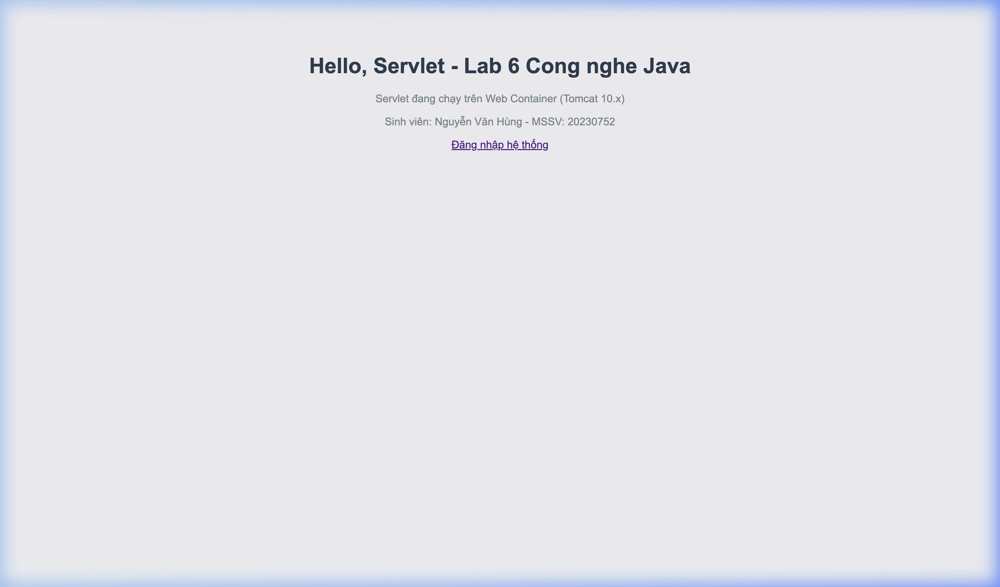
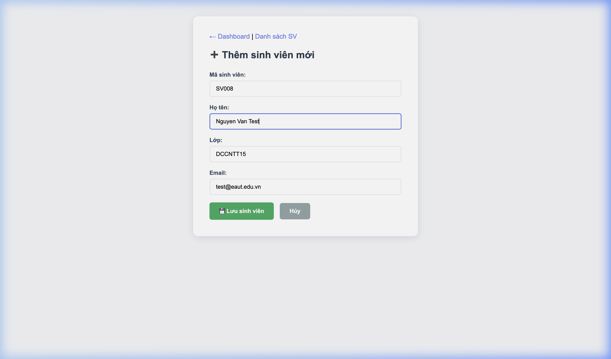
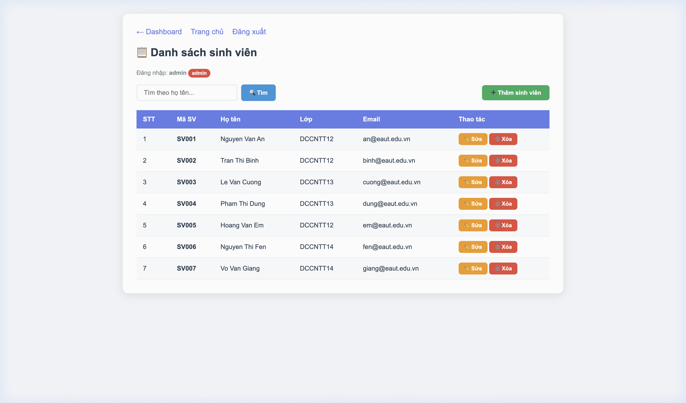
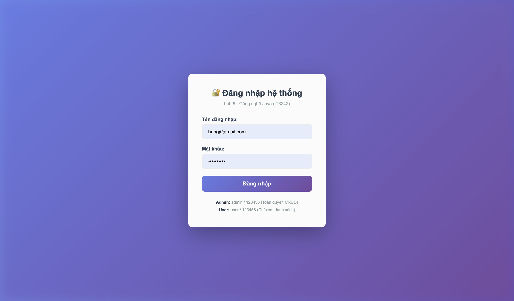
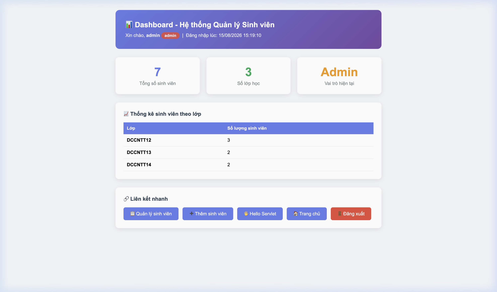
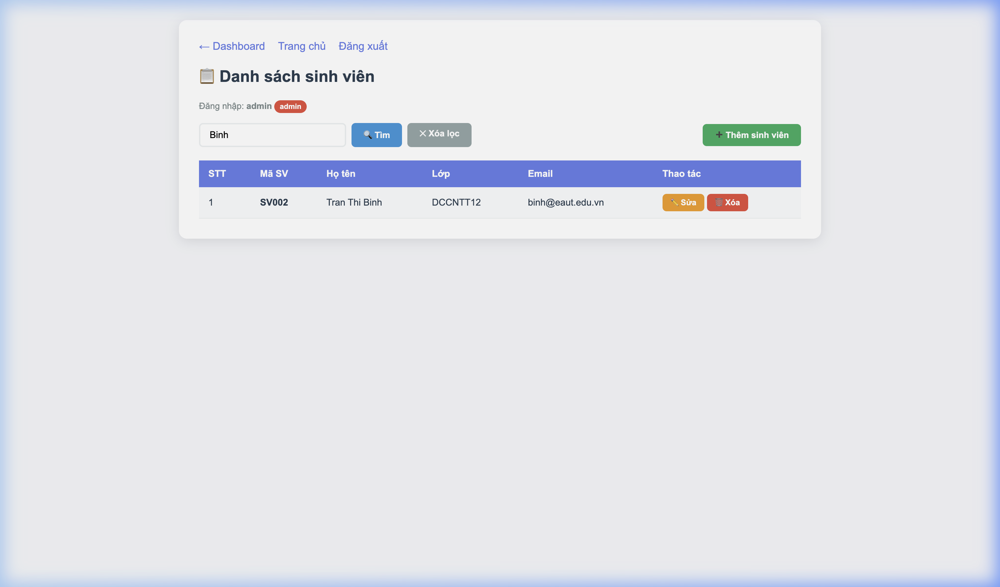
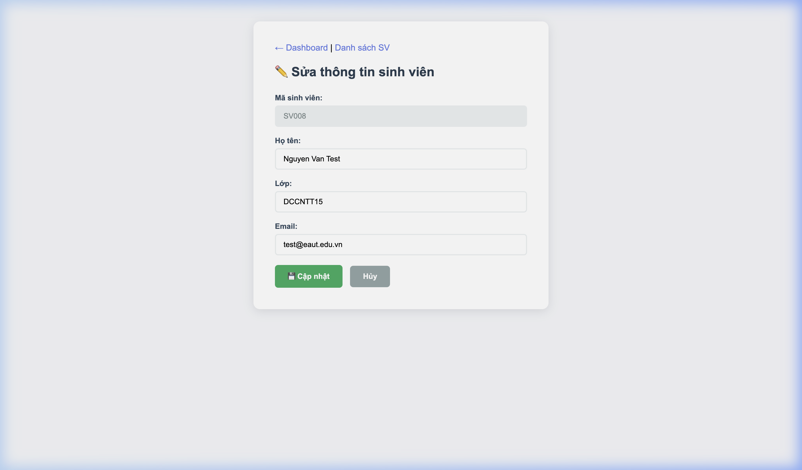
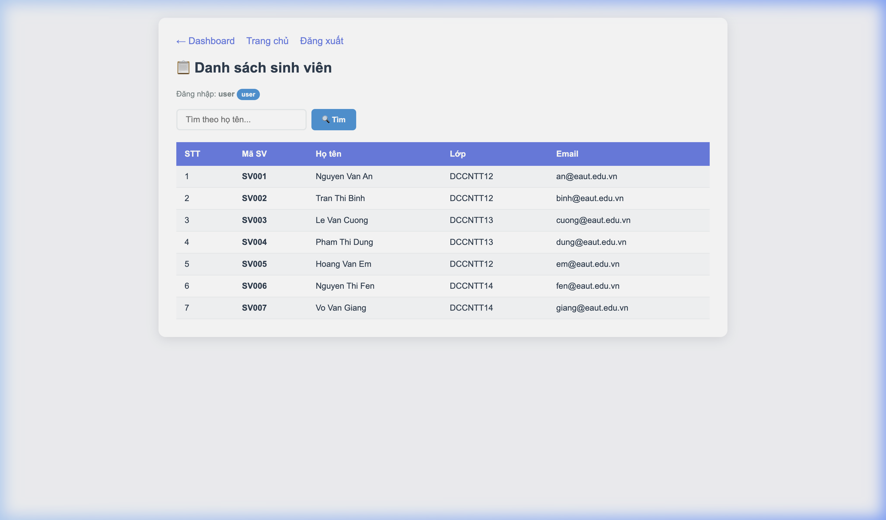
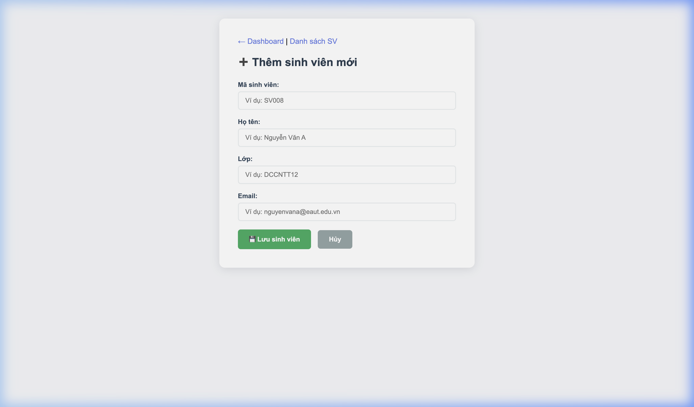

# Báo cáo Lab 6: Xây dựng ứng dụng Web quản lý sinh viên bằng Servlet, JSP, JSTL theo MVC

**Học phần:** Công nghệ Java (IT3242)  
**Sinh viên:** Nguyễn Văn Hùng  
**MSSV:** 20230752  
**Trường:** Đại học Công nghệ Đông Á (EAUT)

---

## 1. Tổng quan

Lab 6 thuộc Chương 3 - Jakarta EE, tập trung xây dựng ứng dụng web quản lý sinh viên chạy trên Apache Tomcat 10.x, sử dụng Servlet, JSP, JSTL, Filter, Listener và mô hình MVC cơ bản.

### Luồng xử lý Request → Servlet → JSP → Response

```
Browser → HTTP Request → AuthFilter (kiểm tra login) → AccessLogFilter (ghi log)
  → Servlet (Controller) → xử lý logic, gọi StudentStore (Model)
  → setAttribute() → RequestDispatcher.forward() → JSP (View) + JSTL
  → HTML Response → Browser
```

### Công nghệ sử dụng
- JDK 17, Apache Maven, Apache Tomcat 10.x (embedded via Cargo Plugin)
- Jakarta Servlet API 6.0.0, JSTL 3.0
- Mô hình MVC: Model (`Student`, `StudentStore`), Controller (`*Servlet`), View (`*.jsp`)

---

## 2. Cấu trúc dự án

```
lab06-student-web/
├── pom.xml
└── src/main/
    ├── java/vn/edu/eaut/lab6/
    │   ├── controller/   (HelloServlet, StudentServlet, LoginServlet, LogoutServlet, DashboardServlet)
    │   ├── filter/       (AuthFilter, AccessLogFilter)
    │   ├── listener/     (AppContextListener, SessionLogListener)
    │   ├── model/        (Student)
    │   └── store/        (StudentStore)
    └── webapp/
        ├── index.jsp, login.jsp, welcome.jsp, dashboard.jsp
        ├── student-form.jsp, student-list.jsp, 403.jsp
        └── WEB-INF/web.xml
```

---

## 3. Kết quả thực hiện

### Bài 1. Servlet hiển thị "Hello, Servlet" (HelloServlet.java)

Tạo Servlet có đường dẫn `/hello`, hiển thị thông báo Hello, Servlet - Lab 6.



### Bài 2. Form nhập thông tin sinh viên (student-form.jsp)

Form nhập mã SV, họ tên, lớp và email. Gửi dữ liệu đến Servlet `/students` bằng POST.



### Bài 3. Hiển thị danh sách sinh viên bằng JSP + JSTL (student-list.jsp)

Sử dụng `c:forEach`, `c:if`, `c:choose` để hiển thị danh sách trong JTable styled.



### Bài 4. Đăng nhập bằng Servlet và Session (LoginServlet.java)

Trang đăng nhập xác thực tài khoản. Đúng → lưu session → redirect Dashboard. Sai → hiển thị lỗi.



### Bài 5. Filter kiểm tra đăng nhập và Listener ghi log

AuthFilter chặn truy cập trang quản trị nếu chưa đăng nhập. AppContextListener ghi log vòng đời ứng dụng. SessionLogListener ghi log session.



### Bài 6. Tìm kiếm sinh viên theo họ tên

Ô tìm kiếm trên trang danh sách. Tìm không phân biệt hoa/thường. Hiển thị thông báo nếu không tìm thấy.



### Bài 7. Xóa sinh viên khỏi danh sách

Nút Xóa ở mỗi dòng. Hiện dialog confirm trước khi xóa. Xóa xong redirect về danh sách.


### Bài 8. Cập nhật thông tin sinh viên

Form sửa hiển thị dữ liệu cũ. Mã sinh viên readonly. Cho phép sửa họ tên, lớp, email.



### Bài 9. Phân quyền Admin/User

Admin (admin/123456) được thêm/sửa/xóa. User (user/123456) chỉ xem danh sách. Truy cập trái phép → 403.jsp.





### Bài 10. Dashboard sau đăng nhập

Hiển thị tên người dùng, vai trò, tổng sinh viên, thống kê theo lớp, thời gian đăng nhập.


### Bài 11. Ghi log truy cập bằng Filter (AccessLogFilter.java)

AccessLogFilter ghi log URI, method, user, thời gian truy cập ra console cho mọi request.

```
[AccessLog] 2026-08-15 15:08:20 | GET /lab06-student-web/students | User: admin
[AccessLog] 2026-08-15 15:08:22 | POST /lab06-student-web/students | User: admin
```

### Bài 12. Khởi tạo dữ liệu mẫu bằng Listener (AppContextListener.java)

AppContextListener khởi tạo 7 sinh viên mẫu khi ứng dụng chạy, lưu vào ServletContext. Ghi log số lượng khi ứng dụng dừng.

```
[AppContextListener] Ung dung Lab 6 da khoi dong!
[AppContextListener] Da khoi tao 7 sinh vien mau vao StudentStore
```

---

## 4. Câu hỏi củng cố

**Câu 1:** Servlet xử lý yêu cầu HTTP qua phương thức nào?  
→ `doGet()` cho GET request, `doPost()` cho POST request. Servlet nhận request, xử lý logic, gọi Model, rồi forward sang JSP.

**Câu 2:** Sự khác biệt giữa `forward()` và `sendRedirect()`?  
→ `forward()` chuyển tiếp trong server (URL không đổi, nhanh hơn). `sendRedirect()` gửi HTTP 302 cho browser (URL thay đổi, tạo request mới).

**Câu 3:** JSTL có ưu điểm gì so với scriptlet Java trong JSP?  
→ JSTL tách biệt logic hiển thị khỏi code Java, dễ đọc, dễ bảo trì. Hạn chế viết `<% %>` trực tiếp trong JSP.

**Câu 4:** Filter hoạt động như thế nào trong Servlet?  
→ Filter chặn request trước khi vào Servlet. Dùng `chain.doFilter()` để cho request đi tiếp hoặc redirect/block nếu cần.

**Câu 5:** Session dùng để làm gì trong ứng dụng web?  
→ Session lưu trạng thái giữa các request (ví dụ: thông tin đăng nhập, vai trò). Tồn tại cho đến khi timeout hoặc `invalidate()`.

---

## 5. Hướng dẫn chạy

```bash
# Build WAR
mvn clean package

# Deploy và chạy Tomcat embedded
mvn package cargo:run

# Truy cập
http://localhost:8080/lab06-student-web/
```

Tài khoản: `admin/123456` (toàn quyền) hoặc `user/123456` (chỉ xem).
