# Lab 8 - Chuyển form sang JSF, validation và message

**Học phần:** Công nghệ Java - IT3242  
**Sinh viên:** Nguyễn Văn Hùng  
**MSSV:** 20230752  
**Lớp:** DCCNTT 14.2  

## Mô tả

Bài lab chuyển form Servlet/JSP sang Jakarta Faces (JSF), sử dụng CDI Bean, Bean Validation, FacesMessage, h:dataTable, và Facelets template.

## Công nghệ

- **JDK 21** + **Maven 3.9.16**
- **Jakarta Faces (Mojarra) 4.0.7** - JSF implementation
- **Weld CDI 5.1.2** - CDI container
- **Hibernate Validator 8.0.1** - Bean Validation
- **Apache Tomcat 10.1.30** (embedded via Cargo plugin)

## Cấu trúc project

```
lab08-jsf-validation/
├── pom.xml
└── src/main/
    ├── java/vn/edu/eaut/lab8/
    │   ├── bean/          (SinhVienBean, SachBean, ProductBean, LoginBean)
    │   ├── model/         (SinhVien, Sach, Product)
    │   └── repository/    (SinhVienRepository, SachRepository, ProductRepository)
    └── webapp/
        ├── template.xhtml, index.xhtml, sinhvien-form/list.xhtml
        ├── sach-form/list.xhtml, product-form/list.xhtml, login.xhtml
        └── WEB-INF/ (web.xml, beans.xml)
```

## Danh sách bài tập (13/13)

| Bài | Mô tả | File chính |
|-----|--------|-----------|
| 1 | Trang JSF đầu tiên | index.xhtml |
| 2 | Model + Repository | SinhVien.java, SinhVienRepository.java |
| 3 | Managed Bean | SinhVienBean.java |
| 4 | Form JSF + Validation + Message | sinhvien-form.xhtml |
| 5 | h:dataTable + Xóa | sinhvien-list.xhtml |
| 6 | Form Sách JSF | SachBean, sach-form/list.xhtml |
| 7 | Form Sản phẩm JSF | ProductBean, product-form/list.xhtml |
| 8 | Form đăng nhập JSF | LoginBean, login.xhtml |
| 9 | Sửa sinh viên | SinhVienBean.edit() |
| 10 | Tìm kiếm sinh viên | SinhVienBean.search() |
| 11 | Layout dùng chung | template.xhtml |
| 12 | selectOneMenu | sinhvien-form.xhtml |
| 13 | So sánh Servlet/JSP vs JSF | Trong báo cáo |

## Cách chạy

```bash
# Build
mvn clean package

# Chạy trên Tomcat 10 embedded
mvn cargo:run

# Truy cập
# http://localhost:8080/lab08-jsf-validation/index.xhtml
```

## Ảnh minh họa

| Trang | Ảnh |
|-------|-----|
| Trang chủ | 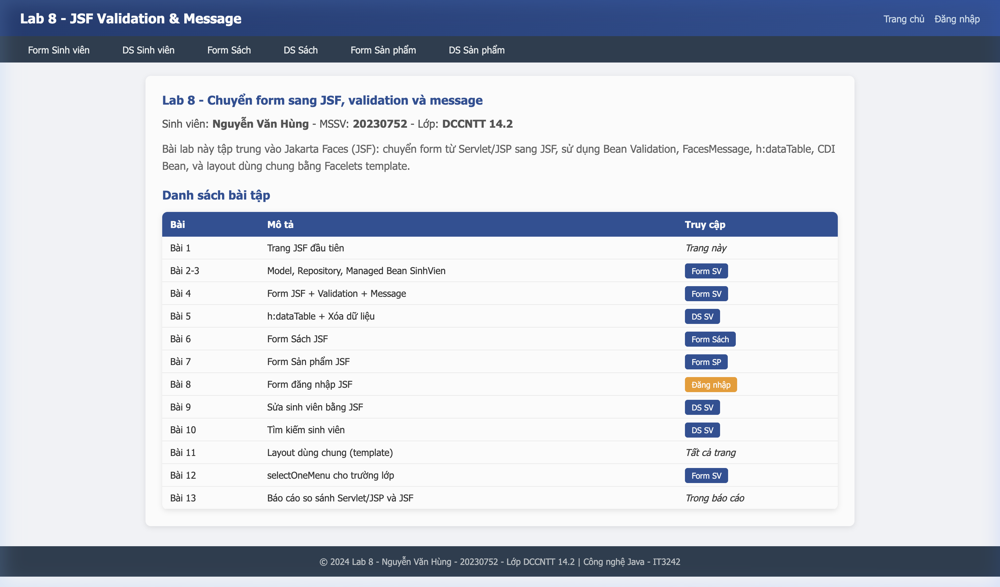 |
| Form sinh viên | 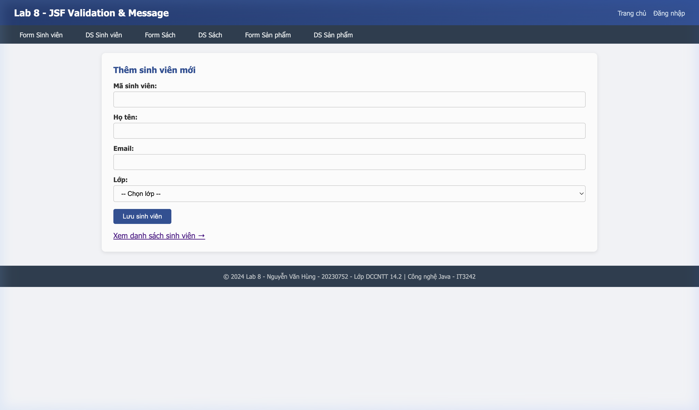 |
| Validation lỗi | 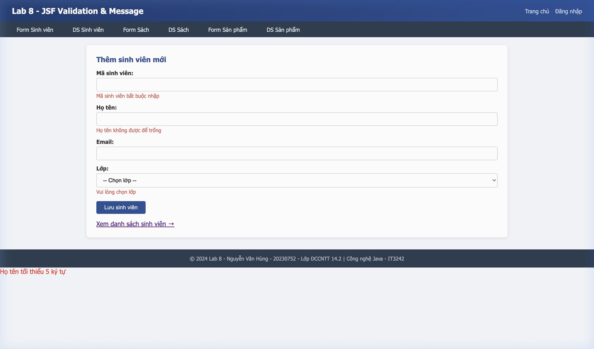 |
| Lưu thành công | 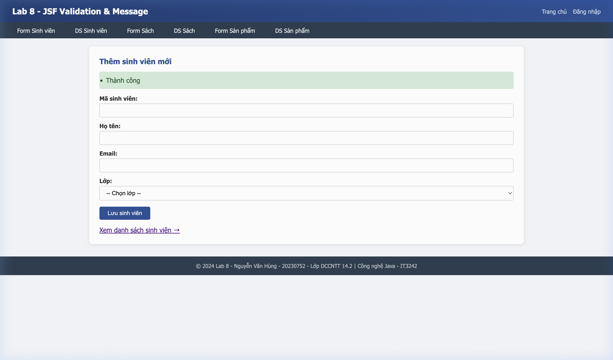 |
| DS sinh viên | 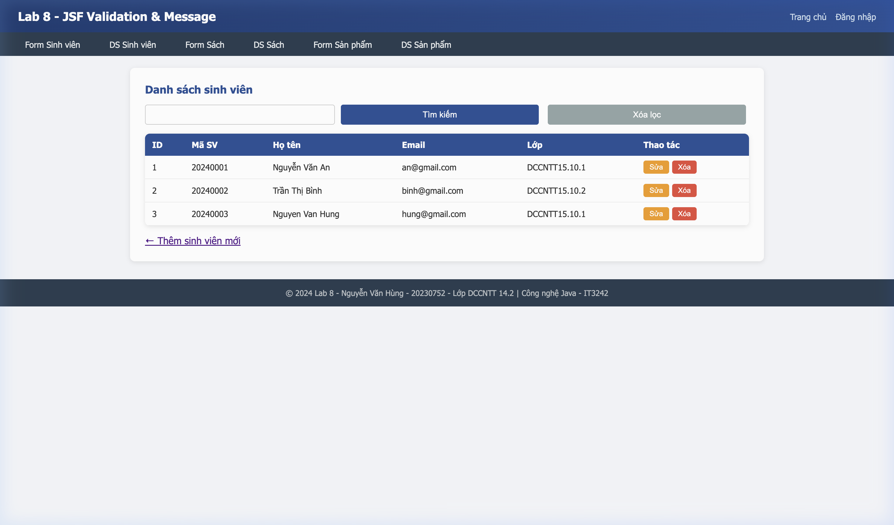 |
| Tìm kiếm | 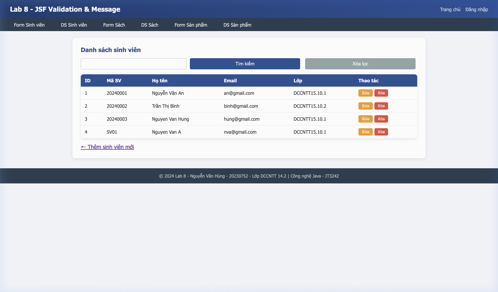 |
| Form sách | 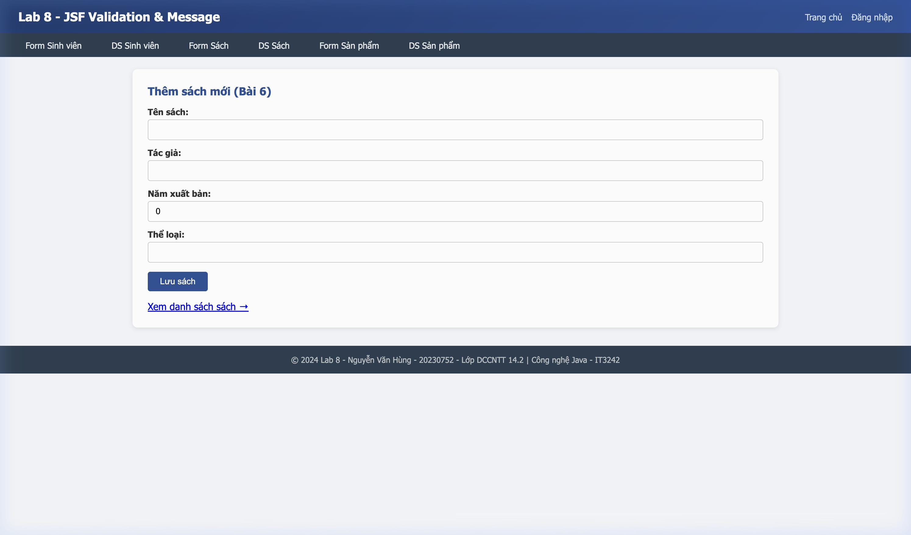 |
| DS sách | 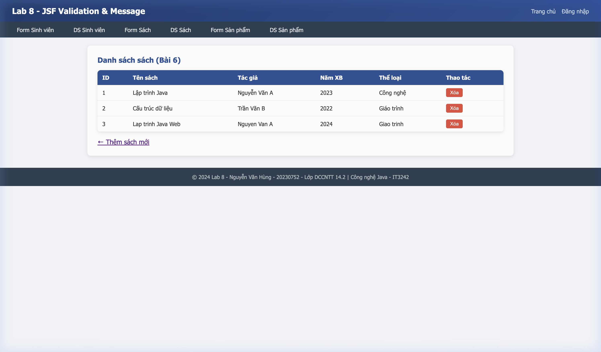 |
| Form sản phẩm | 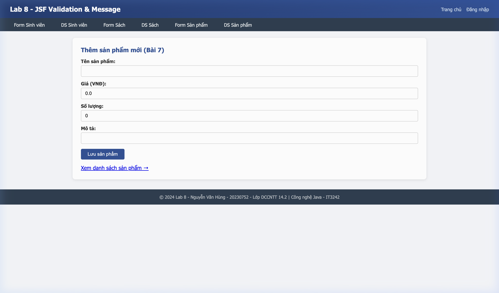 |
| DS sản phẩm | 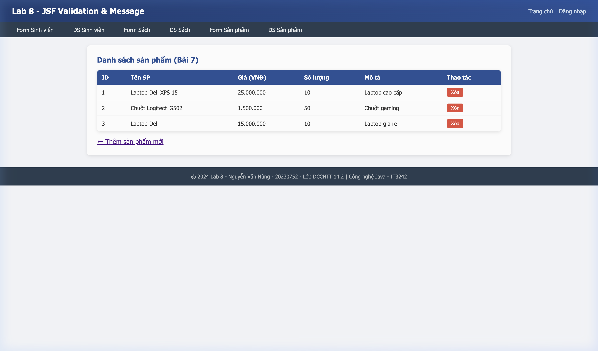 |
| Đăng nhập | 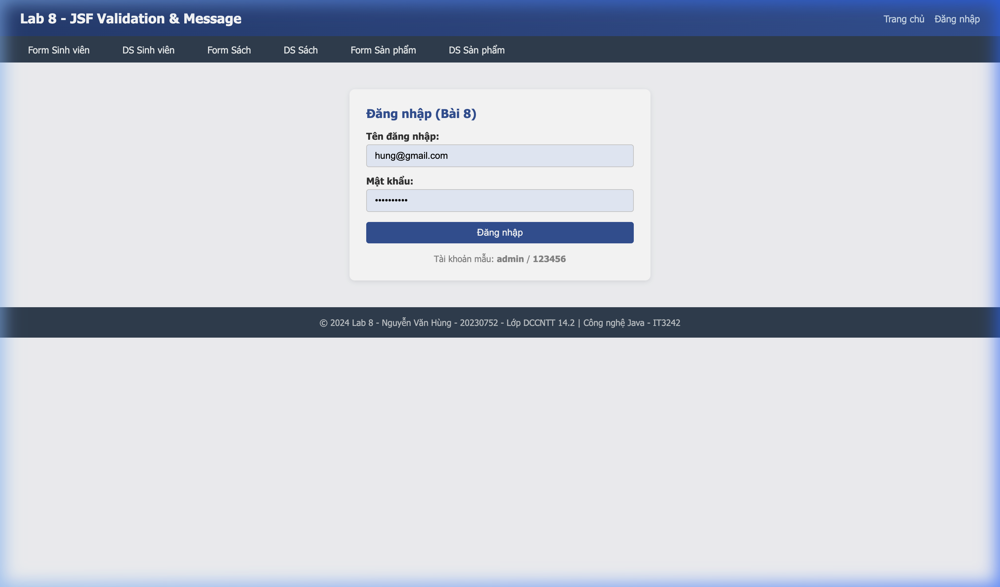 |
| Login lỗi | 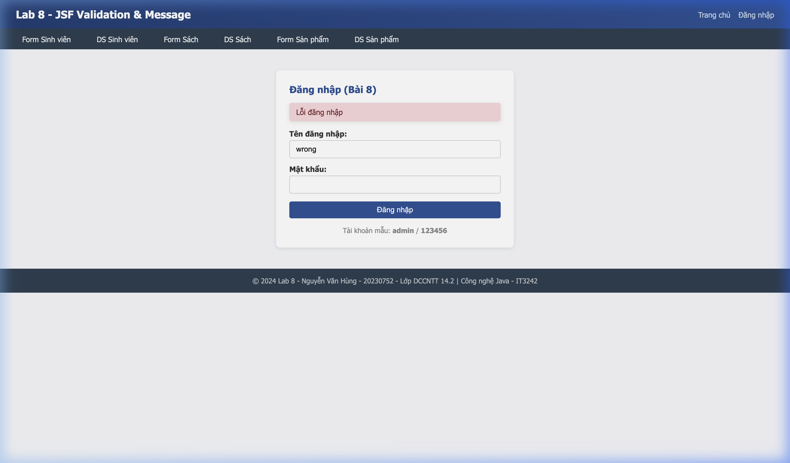 |
