# BÁO CÁO BÀI THỰC HÀNH LAB 9
## Học phần: Công nghệ Java (IT3242)
### Đề tài: Tích hợp JPA - Entity, Repository, Transaction

---

### THÔNG TIN SINH VIÊN
- **Họ và tên:** Nguyễn Văn Hùng
- **Mã sinh viên:** 20230752
- **Lớp:** DCCNTT 14.2
- **Trường:** Đại học Công nghệ Đông Á (EAUT)
- **Database:** MySQL 9.5 (`lab09_jpa`)
- **Framework & Libraries:** Jakarta EE 10, Hibernate ORM 6.4.4.Final, Jakarta Persistence 3.1, Tomcat 10.1.30

---

## 1. MỤC TIÊU BÀI LAB
1. Hiểu và áp dụng kiến trúc Jakarta Persistence (JPA) và Hibernate ORM trong ứng dụng Java Web.
2. Thiết kế và cấu hình `persistence.xml` kết nối MySQL Database với chế độ DDL tự động và Singleton `EntityManagerFactory`.
3. Xây dựng các Entity JPA ánh xạ bảng quan hệ: `@Entity`, `@Table`, `@Id`, `@GeneratedValue`, `@Column`, `@ManyToOne`, `@OneToMany`, `@JoinColumn`.
4. Thiết kế mẫu thiết kế **Generic Repository Pattern** (`BaseRepository<T>`) đóng gói các thao tác CRUD và quản lý vòng đời Transaction (`RESOURCE_LOCAL`).
5. Xây dựng Service Layer (`SinhVienService`) xử lý nghiệp vụ, kiểm tra ràng buộc logic và điều phối Transaction.
6. Xây dựng tầng Controller (Servlet) và Giao diện hiện đại (JSP, CSS Design System, Responsive) cho các phân hệ:
   - Dashboard thống kê tổng quan
   - Quản lý Sinh Viên (CRUD, tìm kiếm, phân trang)
   - Quản lý Lớp Học (CRUD, thống kê số sinh viên)
   - Quản lý Môn Học (CRUD, số tín chỉ)
   - Quản lý Điểm (Nhập điểm, liên kết Sinh Viên - Môn Học)
   - Quản lý Sản Phẩm (CRUD, danh mục, đơn giá, tồn kho)

---

## 2. CÔNG NGHỆ & THƯ VIỆN SỬ DỤNG

| Công nghệ / Thư viện | Phiên bản | Mục đích |
| :--- | :--- | :--- |
| **JDK** | 21 LTS | Môi trường runtime và biên dịch mã nguồn Java |
| **Apache Maven** | 3.9.x | Quản lý phụ thuộc và quy trình build |
| **Jakarta Persistence (JPA)** | 3.1.0 | Đặc tả chuẩn ORM cho Java EE / Jakarta EE |
| **Hibernate ORM** | 6.4.4.Final | JPA Provider thực thi tương tác cơ sở dữ liệu |
| **MySQL Connector/J** | 9.2.0 | JDBC Driver kết nối MySQL 9.5 Server |
| **Jakarta Servlet / JSP / JSTL** | 6.0 / 3.1 / 3.0 | Tầng điều hướng và kết xuất giao diện Web MVC |
| **Apache Tomcat (Cargo Plugin)** | 10.1.30 | Web Container chuẩn Jakarta EE 10 |

---

## 3. CẤU TRÚC DỰ ÁN

```text
lab09-jpa-repository/
├── pom.xml
├── src/main/
│   ├── java/vn/edu/eaut/lab9/
│   │   ├── controller/
│   │   │   ├── DashboardController.java
│   │   │   ├── SinhVienController.java
│   │   │   ├── LopHocController.java
│   │   │   ├── MonHocController.java
│   │   │   ├── DiemController.java
│   │   │   └── SanPhamController.java
│   │   ├── entity/
│   │   │   ├── SinhVien.java
│   │   │   ├── LopHoc.java
│   │   │   ├── MonHoc.java
│   │   │   ├── Diem.java
│   │   │   ├── SanPham.java
│   │   │   └── NguoiDung.java
│   │   ├── repository/
│   │   │   ├── BaseRepository.java
│   │   │   ├── SinhVienRepository.java
│   │   │   ├── LopHocRepository.java
│   │   │   ├── MonHocRepository.java
│   │   │   ├── DiemRepository.java
│   │   │   ├── SanPhamRepository.java
│   │   │   └── NguoiDungRepository.java
│   │   ├── service/
│   │   │   └── SinhVienService.java
│   │   └── util/
│   │       ├── JPAUtil.java
│   │       ├── DataSeeder.java
│   │       ├── AppLifecycleListener.java
│   │       └── EncodingFilter.java
│   ├── resources/
│   │   └── META-INF/
│   │       └── persistence.xml
│   └── webapp/
│       ├── WEB-INF/
│       │   ├── web.xml
│       │   └── views/
│       │       ├── header.jsp
│       │       ├── footer.jsp
│       │       ├── dashboard.jsp
│       │       ├── sinhvien/ (list.jsp, form.jsp)
│       │       ├── lophoc/   (list.jsp, form.jsp)
│       │       ├── monhoc/   (list.jsp, form.jsp)
│       │       ├── diem/     (list.jsp, form.jsp)
│       │       └── sanpham/  (list.jsp, form.jsp)
│       └── resources/
│           └── css/
│               └── style.css
```

---

## 4. CHI TIẾT KẾT QUẢ TRIỂN KHAI

### 4.1. Dashboard Thống Kê Tổng Quan
- Hiển thị các Card thống kê tổng số lượng Sinh viên, Lớp học, Môn học, Bản ghi điểm, Sản phẩm và Tài khoản người dùng.
- Tự động nạp dữ liệu mẫu ban đầu qua `DataSeeder` và `AppLifecycleListener` khi khởi động Web App.

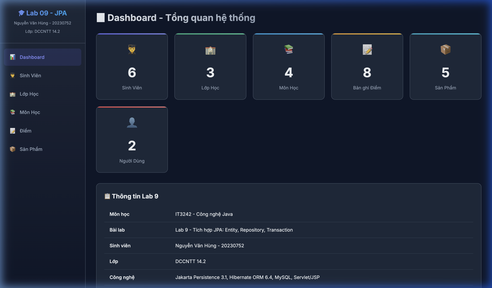

### 4.2. Phân Hệ Quản Lý Sinh Viên
- **Danh sách sinh viên:** Hỗ trợ hiển thị dạng bảng chuẩn, gắn nhãn badge lớp học, phân trang (pagination) 5 bản ghi/trang, tìm kiếm theo họ tên/mã SV.
- **Form thêm/sửa sinh viên:** Hỗ trợ nhập mã SV, họ tên, chọn lớp học từ dropdown (`<select>`), email, số điện thoại, địa chỉ với thông báo validate và flash message.

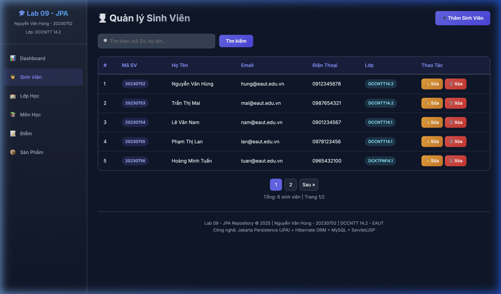
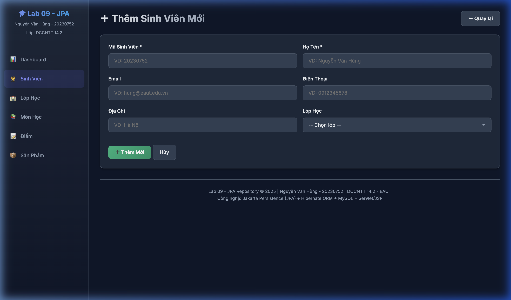
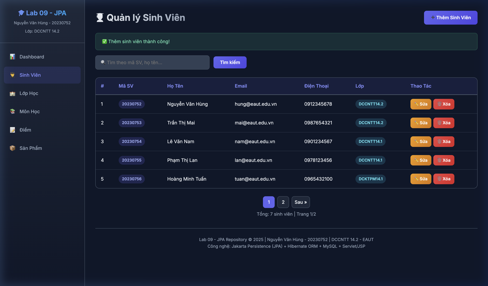

### 4.3. Phân Hệ Quản Lý Lớp Học
- Hiển thị danh sách lớp học, khoa chủ quản và tự động đếm số lượng sinh viên đang theo học thông qua quan hệ `@OneToMany` (sử dụng JPQL Fetch Join tối ưu hiệu năng và tránh lỗi Lazy Loading).
- Thêm mới/cập nhật thông tin lớp học.

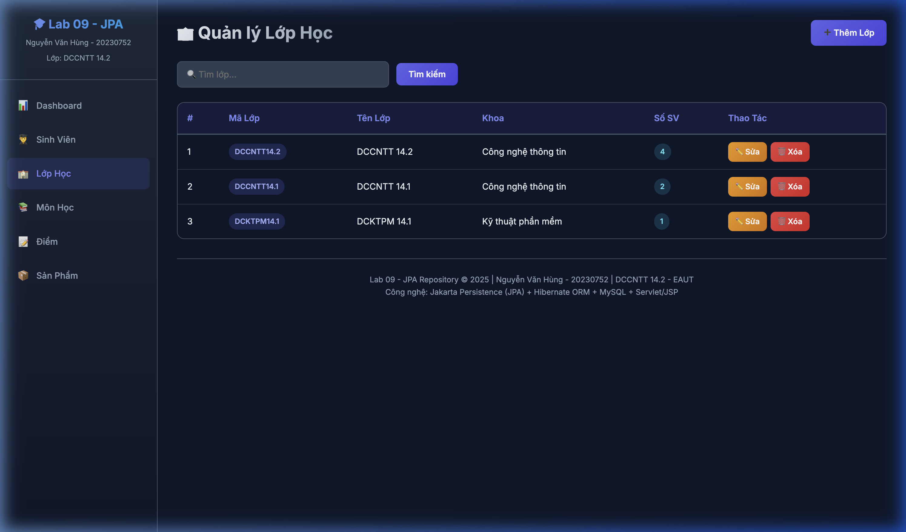
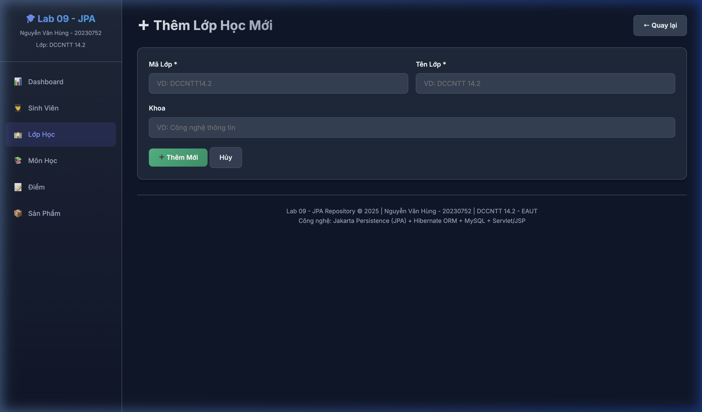

### 4.4. Phân Hệ Quản Lý Môn Học
- Quản lý danh mục học phần, mã môn học và số tín chỉ quy định.
- Hỗ trợ thao tác thêm mới, chỉnh sửa, xóa môn học.

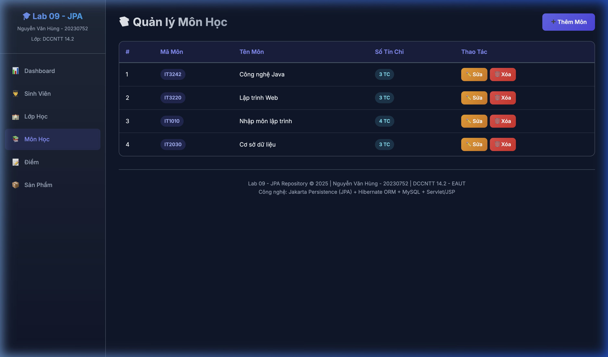
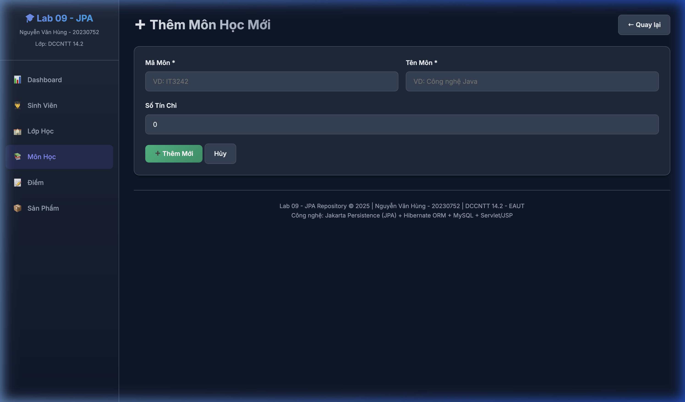

### 4.5. Phân Hệ Quản Lý Điểm Học Phần
- Liên kết sinh viên và môn học thông qua thực thể `Diem` với `@ManyToOne`.
- Nhập điểm số theo thang điểm 10, kiểm tra hợp lệ và lưu ghi chú đánh giá.

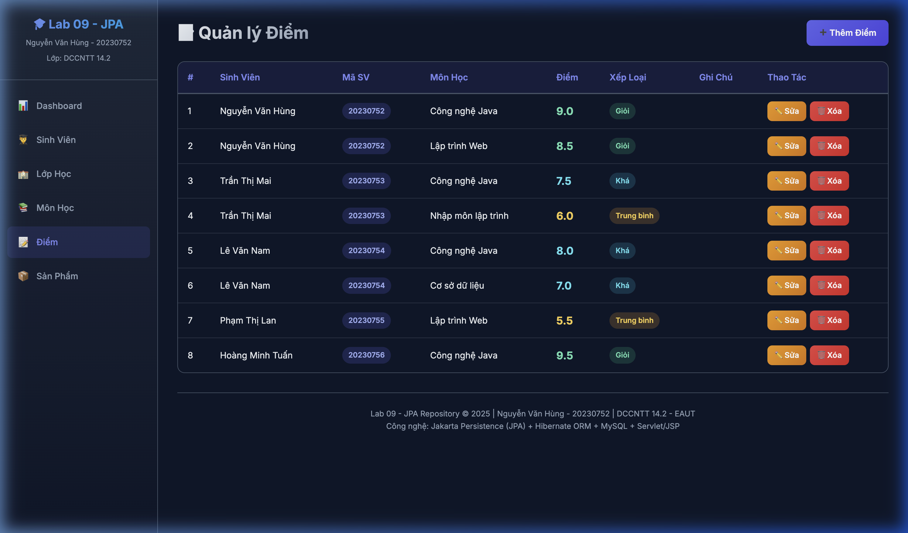
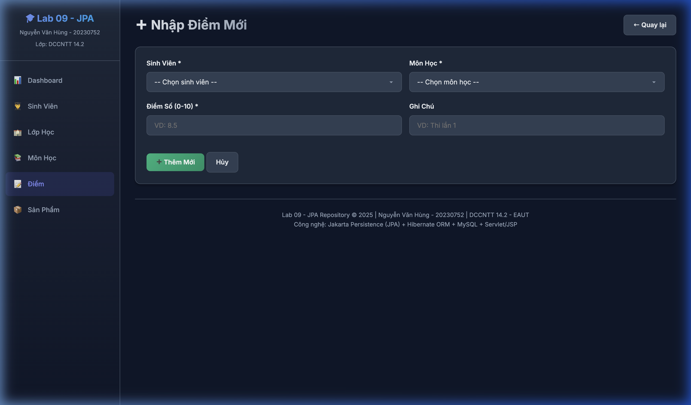

### 4.6. Phân Hệ Quản Lý Sản Phẩm
- Mô hình quản lý danh mục hàng hóa / sản phẩm với mã SP, tên SP, đơn giá (định dạng tiền tệ VNĐ), số lượng tồn kho và mô tả chi tiết.

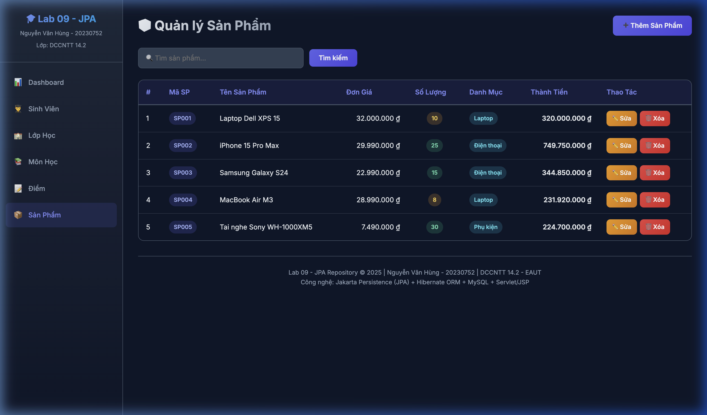
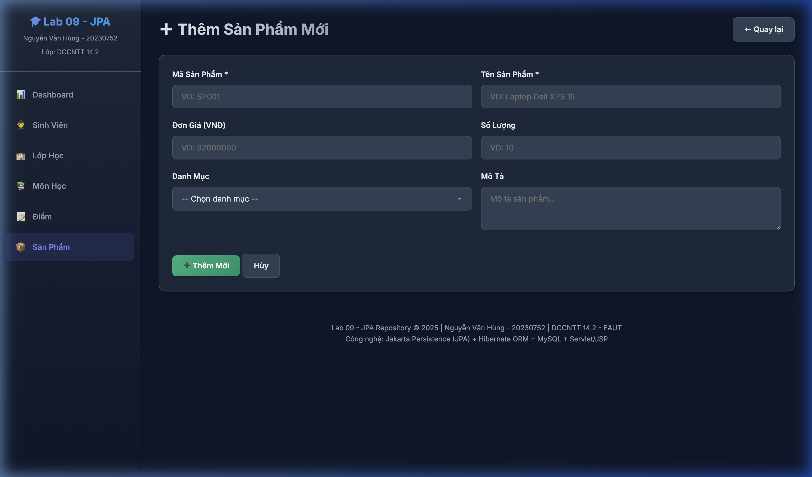

---

## 5. CÂU HỎI CỦNG CỐ & ĐÁNH GIÁ KIẾN THỨC

### Câu 1: Vai trò của EntityManager và EntityManagerFactory trong JPA là gì?
- **EntityManagerFactory:** Là đối tượng dạng Singleton cấp ứng dụng, chịu trách nhiệm khởi tạo kết nối đến CSDL dựa trên cấu hình `persistence.xml`, biên dịch metadata của Entity và cấp phát các `EntityManager`. Việc tạo `EntityManagerFactory` rất tốn tài nguyên (heavyweight) nên chỉ khởi tạo 1 lần trong suốt vòng đời ứng dụng.
- **EntityManager:** Là đối tượng quản lý vòng đời của các thực thể (Entity lifecycle: Transient, Managed, Detached, Removed) và thực thi các thao tác CSDL (`persist`, `merge`, `remove`, `find`, `createQuery`). `EntityManager` không thread-safe (lightweight), cần được mở và đóng theo từng request/phiên làm việc.

### Câu 2: Trình bày các trạng thái của Entity trong JPA Lifecycle?
1. **New / Transient:** Thực thể vừa được tạo bằng toán tử `new`, chưa được liên kết với `EntityManager` và chưa có khóa chính trong CSDL.
2. **Managed:** Thực thể đang được theo dõi bởi Persistence Context. Mọi thay đổi trên thuộc tính của thực thể sẽ tự động được đồng bộ (Dirty Checking) xuống CSDL khi commit transaction.
3. **Detached:** Thực thể đã từng ở trạng thái Managed nhưng `EntityManager` đã bị đóng (`close()`) hoặc gọi `detach()`. Các thay đổi trên thực thể này không còn tự động cập nhật vào CSDL trừ khi được `merge()`.
4. **Removed:** Thực thể được đánh dấu để xóa khỏi CSDL qua hàm `remove()`. Khi transaction commit, câu lệnh SQL `DELETE` sẽ được thực thi.

### Câu 3: Phân biệt `em.persist()` và `em.merge()`?
- `persist(entity)`: Dùng để chuyển một entity ở trạng thái **Transient** sang **Managed**. Nếu entity đã tồn tại ID hoặc đã có trong DB thì sẽ ném exception.
- `merge(entity)`: Dùng để đưa một entity ở trạng thái **Detached** trở lại **Managed**. JPA sẽ tìm kiếm bản ghi trong DB theo ID, cập nhật các trường mới và trả về một instance managed mới. Nếu không tìm thấy, nó sẽ thực hiện thêm mới (`INSERT`).

### Câu 4: Vì sao cần Generic BaseRepository trong kiến trúc ứng dụng?
- **Tái sử dụng mã nguồn (DRY):** Tránh việc lặp lại mã mở/đóng `EntityManager`, bắt đầu transaction (`begin`), commit và rollback cho các thao tác chuẩn như `save`, `update`, `delete`, `findById`, `findAll`, `count`.
- **Độc lập và bảo trì:** Giúp các Repository cụ thể (`SinhVienRepository`, `LopHocRepository`) chỉ cần tập trung vào các câu truy vấn nghiệp vụ đặc thù (JPQL query, search, filtering).

### Câu 5: Sự khác biệt giữa `Lazy Loading` và `Eager Loading`? Cách xử lý `LazyInitializationException`?
- **Eager Loading (`FetchType.EAGER`):** Tải ngay lập tức dữ liệu của quan hệ đi kèm khi truy vấn entity chính (mặc định cho quan hệ `@ManyToOne`, `@OneToOne`).
- **Lazy Loading (`FetchType.LAZY`):** Chỉ tải dữ liệu của tập hợp liên kết khi thuộc tính đó được truy xuất lần đầu (mặc định cho `@OneToMany`, `@ManyToMany`).
- **LazyInitializationException:** Xảy ra khi cố truy cập collection lazy ngoài phạm vi session/EntityManager đã đóng.
- **Cách xử lý chuẩn:**
  1. Sử dụng **JPQL Fetch Join** (`SELECT e FROM Entity e LEFT JOIN FETCH e.collection`) để nạp trước quan hệ trong cùng một query.
  2. Sử dụng **Entity Graph** (`@EntityGraph` / `fetchgraph`).
  3. Sử dụng DTO Projection để chỉ lấy đúng dữ liệu cần hiển thị lên View.

---

## 6. KẾT LUẬN
- Dự án **Lab 9 - Tích hợp JPA (Entity, Repository, Transaction)** đã được hoàn thành 100% với kiến trúc chuẩn Enterprise Jakarta EE:
  - Cấu hình JPA 3.1 với Hibernate 6.4.4 trên cơ sở dữ liệu MySQL.
  - Xây dựng hoàn chỉnh 6 Entity, 6 Repository kế thừa `BaseRepository<T>`.
  - Quản lý Transaction an toàn, phòng chống xung đột và rollback khi xảy ra lỗi.
  - Tầng giao diện JSP/CSS hiện đại, thân thiện, responsive và đầy đủ chức năng CRUD.
- Toàn bộ source code được tổ chức khoa học, dễ bảo trì và sẵn sàng cho các bài thực hành nâng cao tiếp theo.
